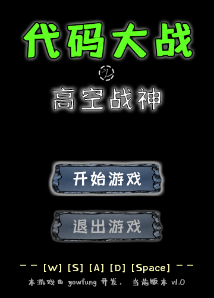
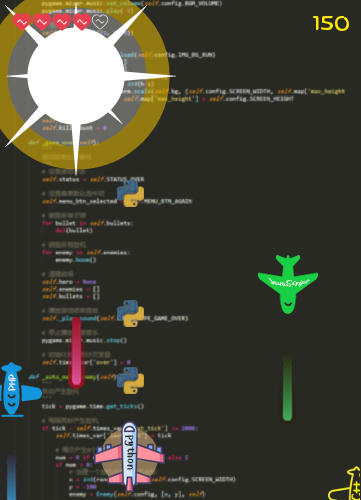
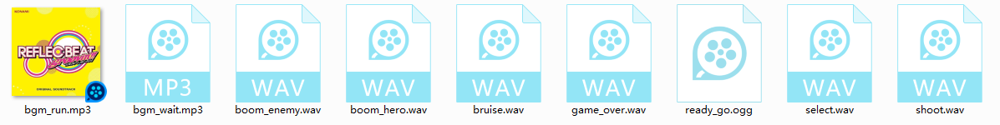
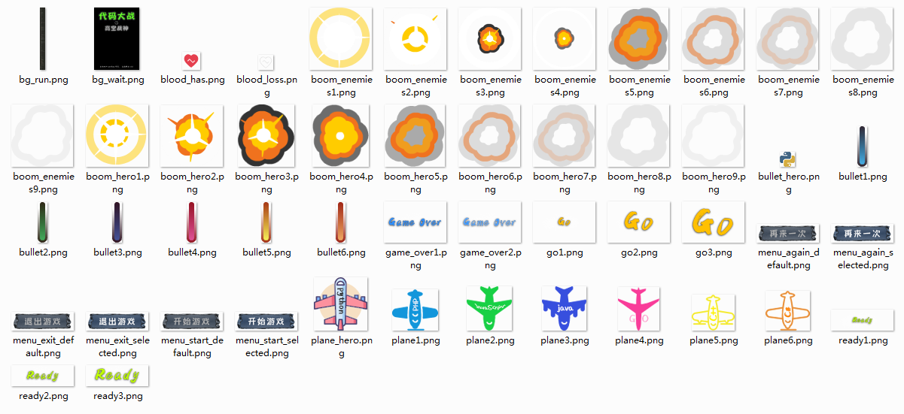
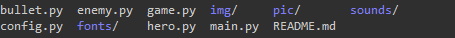

### 项目介绍

一个基于 pygame 的代码大战小游戏，类似于飞机大战游戏。


### 演示视频

戳这里观看该游戏运行的演示视频：[https://www.bilibili.com/video/av56112017/](


### 游戏背景

​		自从 PHP 大张旗鼓宣称其为世界上最好的编程语言后，世界各路编程语言群起讨伐，战火一直蔓延到21世纪中叶。战争有时候并不总是带来毁灭性的灾难，甚至会促进世界大发展、促进社会大进步，俗话说“乱世出英雄”，在这样一个战火不休的乱世之中，有个叫 Python 的家伙在人工智能、大数据、深度学习等各路具有先进思想之人的拥护下一夜崛起，成为了当下的世界霸主。然而那些也曾是世界列强的PHP、Java、C++、C#等岂能善罢甘休？于是，一场平定各路编程语言群起暴乱、巩固 Python 霸权地位、维护世界和平的大战即将拉开序幕……

### 玩家说明

​		启动游戏，在主界面上显示操作帮助和功能菜单，你可以使用 [w]/↑ 和 [S]/下 按键选择菜单，然后按下 [SPACE] 键以进入菜单。



​		开始游戏后，你会来的一个叫做 “代码废墟” 的战场。你可以通过 [A]/← 和 [D]/→ 按键控制 Python 战机移动，通过 [SPACE] 按键控制 Python 战机发射蟒蛇炮弹。你要尽可能多的消灭敌方战机，这样你会有更多的得分。



​		你应该时刻注意其他战机对你发射的枪林弹雨，被击中后你会丧失一颗能量心，你总共会有五颗能量心，当你能量心全部消耗殆尽会，你的战机会毁灭，然后就 Game Over 了。另外，你的战机如果被敌机撞到，它将会立即毁灭。

​		战争无情，战火不断，祝你好运！


### 游戏开发

​		你一定很好奇这个游戏是怎么开发的吧？这其实不会很难，我在写这个游戏时，总共也才用了一千多行代码而已。下面让我来告诉你这个游戏的整个开发过程吧！

##### 准备工作

> **开发环境：**
>
> - Windows 10
> - python 3.7
>
> **工具软件：**
>
> - PhotoShop CC
> - Sublime Text 3
> - GitBash
> - pip19.1.3
>
> **安装 Python 包：**
>
> - `pip install pygame`
>
> **准备素材：**
>
> - 音效素材：包括背景音乐、菜单选择音效、子弹发射音效、爆炸音效等。
> - 图像素材：包括游戏背景图、战机图像、子弹图像、爆炸效果图、菜单按钮图等。
> - 字体素材：用于让界面上的文字显示得更好看点。

##### 游戏设计思路

> **游戏规则设定：**
>
> - 我方战机（Python战机）通过发射子弹来消灭众多的敌方战机（C++战机、Java战机、C#战机、JavaScript战机、PHP战机、GO战机等）；
> - 敌方战机也可以发射子弹攻击我方战机；
> - 我方被攻击后会损失血量，血量为零时则爆炸阵亡；
> - 被敌方撞击后，我方也会爆炸阵亡；
> - 敌方战机可以被一次性击毁；
> - 敌方战机从远处飞往我方战机，只能直线飞行，我方战机可以移动位置；
> - 每消灭一个敌方战机，则得50分；
> - 我方战机阵亡则游戏结束。
>
> **游戏界面设定：**
>
> - 暗色主题；
> - 矩形窗口，竖屏显示；
> - 重要信息突出；
> - 不同战机区分明显。
>
> **游戏流程设定：**
>
> - 启动游戏后播放背景音乐，显示功能菜单；
> - 通过功能菜单选择开始游戏或退出游戏；
> - 选中开始游戏后，出现 Ready, Go 提示界面，然后正式开始游戏；
> - 正式开始游戏，播放游戏背景音乐，加载游戏地图，显示我方战机，随机出现敌方战机；
> - 游戏中显示我方战机血量和得分情况，如若血量为零，则游戏结束；
> - 游戏结束，显示得分情况，显示 Game Over 界面，出现功能菜单，可选择继续游戏或退出游戏。

##### 游戏素材采集和制备

​		对于音效素材，可以在音效素材网站下载，例如 [爱给网](http://www.aigei.com/sound/class)，也可以自行录制剪辑。对于背景音乐，可支持ogg、mp3等格式；对于音效，可以是ogg、wav等格式。



​		对于字体素材，可以在字体素材网站下载。

​		对于图像图标素材，可以在图库网站下载，例如 [iconfont](https://www.iconfont.cn)，也可以使用 PhotoShop 自己绘制。图像尽量使用具有透明通道的 png 格式文件。



##### 游戏程序设计

​		为了使游戏开发更加简单和高效，这里采用高度面向对象思想，将游戏中的每一个用例均对象化；同时，为了使游戏更具有可维护性和可升级性，游戏中的一切配置信息均独立写在配置文件中，只需通过修改配置文件，即可完成对游戏的配置和改造。

> **项目文件结构：**
>
> 
>
> 该项目将每一个类独立写成一个 py 文件，其中包含我方战机的 `Hero` 类、敌方战机的 `Enemy` 类、炮弹的 `Bullet` 类、游戏（战场）类 `Game`，另外 `main.py` 为主程序入口，`config.py` 为游戏全局配置文件。

> **游戏配置文件：**
>
> 该文件（`config.py`）定义了游戏中的一些相关配置、素材文件路径等：
>
> ```python
> # 游戏名称
> # 坐标及尺寸配置
> # 时钟配置
> # 游戏规则配置
> # 声音配置
> # 按键配置
> # 字体素材配置
> # 图像素材配置
> # 音乐素材配置
> ```

> **主程序入口：**
>
> 在 `main.py` 文件中，首先导入配置文件对象和游戏对象，然后实例化一个游戏对象，接着是运行游戏：
>
> ```python
> import config
> from game import Game
> 
> if __name__ == '__main__':
> 	# 创建一个游戏对象，并导入配置
> 	game = Game(config)
> 
> 	# 运行游戏
> 	game.run()
> ```

> **游戏（战场）类：**
>
> 在这个类文件（`game.py`）里，做了一些游戏的初始化工作，例如定义游戏属性、设定游戏状态等。另外菜单按钮的生成、事件监听、战场布置、战机创建等均在此类中定义：
>
> ```python
> class Game(object):
> 	"""
> 	游戏类
> 	"""
> 	# 定义类常量
> 
> 	def __init__(self, config):
> 		"""
> 		构造方法，类初始化
> 		:param config: 		游戏配置对象
> 		"""
> 		# 加载游戏配置对象
> 		# 初始化 pygame
> 		# 初始化游戏时钟
> 		# 创建和设置窗体
> 		# 加载背景图片和背景音乐
> 		# 初始化游戏角色和武器容器
>     	# 初始化游戏属性
> 		# 初始化菜单
> 		# 初始化类变量
> 		# 设置默认游戏状态
> 
> 	def run(self):
> 		"""
> 		游戏运行
> 		"""
>         while True:
> 			# 事件处理
> 			# 执行按键事件
> 			# 更新游戏画面显示
> 			# 如果正在游戏中，则自动产生敌机
> 			# 更新时钟
> 
> 	def _create_btn(self, btn_id, y_pos, sel=False):
> 		"""
> 		创建菜单按钮
> 		:param btn_id:		按钮 ID
> 		:param y_pos: 		垂直方向坐标
> 		:param sel:			是否被选中
> 		:return:			{btn object}
> 		"""
> 
> 	def _update_screen(self):
> 		"""
> 		更新画面显示
> 		"""
>         # 清屏
> 		# 恢复允许清屏
> 
> 		# 如果游戏未开始
> 		if self.status == self.STATUS_WAIT:
> 			# 重画背景
> 			# 更新菜单选中情况
> 			# 显示游戏按键说明
> 
> 		# 如果游戏即将开始
> 		elif self.status == self.STATUS_READY:
> 			# 显示 ready 画面
> 			# 显示 go 画面
> 			# ready 完成，正式开始游戏
> 
> 		# 如果游戏正在进行中
> 		elif self.status == self.STATUS_RUN:
> 			# 清屏
> 			# 刷新背景图片
> 			# 刷新显示子弹
> 			# 刷新显示敌机
>             
> 			# 刷新主角状态
> 			if self.hero.alive:
> 				# 主角还活着，刷新显示主角
> 				# 显示主角血量
> 				# 显示游戏得分
> 			else:
> 				# 主角已死亡，标记游戏结束
> 
> 		# 如果游戏已结束
> 		elif self.status == self.STATUS_OVER:
> 			# 动态闪烁 Game Over 标题，每秒闪一次
> 			# 更新菜单选中情况
> 			# 显示游戏得分结果
> 			# 显示游戏杀敌数结果
> 
> 	def _set_menu(self, menu_type, sel_btn):
> 		"""
> 		设置菜单
> 		:param menu_type:	菜单类型
> 		:param sel_btn:		选中哪个按钮
> 		"""
> 		# 删除原有的菜单按钮
> 		# 显示菜单
>         
> 	def _refresh_enmies(self):
> 		"""
> 		刷新敌机列表，去除已毁灭的敌机，让活着的敌机继续飞
> 		"""
>         # 遍历每一个敌机
>         # 如果敌机已阵亡，则进行内存回收
>         # 如果敌机还活着，则让敌机继续飞行
> 
> 	def _refresh_bullets(self):
> 		"""
> 		刷新子弹列表，去除已消失的子弹
> 		"""
>         # 遍历战场中的每一颗炮弹
>         # 如果炮弹已无效，则进行内存回收
>         # 否则让炮弹继续飞行
> 
> 	def _game_ready(self):
> 		"""
> 		游戏准备开始处理事件
> 		"""
> 		# 清除菜单选中项
> 		# 设置游戏状态
> 		# 初始化帧动画计次变量
> 		# 创建主角对象
> 		# 停止播放背景音乐
> 		# 播放游戏准备开始的音效
> 
> 	def _game_start(self):
> 		"""
> 		游戏正式开始
> 		"""
> 		# 设置游戏状态
> 		# 播放游戏进行时的背景音乐
> 		# 清屏
> 		# 设置游戏背景
> 		# 初始化得分和杀敌数
> 
> 	def _game_over(self):
> 		"""
> 		游戏结束处理事件
> 		"""
> 		# 设置游戏状态
> 		# 设置菜单默认选中项
> 		# 销毁所有子弹
> 		# 销毁所有敌机
> 		# 清理战场
> 		# 播放游戏结束音效
> 		# 停止播放背景音乐
> 		# 初始化帧动画计次变量
> 
> 	def _auto_make_enemy(self):
> 		"""
> 		自动产生敌机
> 		"""
> 		# 每隔两秒产生敌机
> 		# 每次产生0个或1个敌机
> 		# 设置随机坐标
> 		# 添加到列表中
> 
> 	def _process_keys_event(self):
> 		"""
> 		处理按键事件
> 		"""
>         # 遍历按下的每一个按键
> 		# 执行按键对应的功能事件
> 
> 	def _play_sound(self, sound_type):
> 		"""
> 		播放音效
> 		:param sound_type: 	音效类型
> 		"""
> 		# 加载音效
>            # 播放音效
> ```

> **我方战机类：**
>
> 在这个类（`hero.py`）里，定义了我方战机的所有属性和方法：
>
> ```python
> class Hero(object):
> 	"""
> 	主角类
> 	"""
> 	# 定义类常量
> 
> 	def __init__(self, config, game):
> 		"""
> 		构造函数，初始化主角；类
> 		:param config: 		游戏配置对象
> 		:param game:		游戏对象
> 		"""
>         # 加载配置
> 		# 设置主角属性（血量、生存状态、是否正在爆炸、子弹库等）
> 		# 加载主角图像
> 		# 设置初始坐标
> 		# 初始化类变量
> 		# 初始化时钟
> 
> 	def move(self, direction):
> 		"""
> 		移动位置
> 		:param direction: 	移动方向（可选 MOVE_DIR_LEFT, MOVE_DIR_RIGHT）
> 		"""
>         # 如果主角已经阵亡了，则禁止移动操作
> 		# 执行向左或向右移动
> 
> 	def shoot(self):
> 		"""
> 		发射子弹
> 		"""
> 		# 每次发弹之间的间隔最少为 0.3 秒
>         # 创建子弹对象并初始化坐标
>         # 子弹发射者为主角，飞行方向为向上
>         # 将子弹添加到列表
>         # 播放发射子弹的音效
> 
> 	def bruise(self):
> 		"""
> 		受伤减血
> 		"""
>         # 如果正在爆炸或已标记阵亡，则不进行减血处理
> 		# 减血
> 		# 播放被攻击的音效
> 		# 复位闪烁计次变量
> 
> 	def boom(self):
> 		"""
> 		被毁灭
> 		"""
> 		# 标记正在爆炸
> 		# 清空子弹库
> 		# 播放爆炸的音效
> 
> 	def show(self):
> 		"""
> 		显示主角
> 		"""
>         # 如果已阵亡或正在爆炸，则不显示
>         # 根据坐标信息显示主角
> 
> 		# 如果是正在爆炸的话，则显示爆炸动画
> 		# 爆炸结束时，标记主角已死亡
> 
> 	def refresh_bullets_list(self):
> 		"""
> 		刷新子弹库，删掉已标记死亡的子弹
> 		"""
> 		# 遍历子弹库里的每一个子弹
>         # 若子弹已失效，则从子弹库中移除
> 
> 	def _play_sound(self, sound_type):
> 		"""
> 		播放音效
> 		:param sound_type: 	音效类型
> 		"""
> 		# 加载音效
>         # 播放音效
> ```

> **敌方战机类：**
>
> 这个类（`enemy.py`）里，定义了敌方战机的所有属性和方法：
>
> ```python
> class Enemy(object):
> 	"""
> 	敌机类
> 	"""
> 
> 	def __init__(self, config, pos, game):
> 		"""
> 		构造方法，初始化敌机
> 		:param config:		游戏配置对象
> 		:param pos:			初始坐标位置
> 		:param game:		游戏对象
> 		"""
>         # 加载配置
> 		# 设置战机属性
> 		# 加载战机图像
> 		# 初始化类变量
> 		# 初始化时钟
> 
> 	def fly(self):
> 		"""
> 		敌机出击
> 		"""
>         # 如果敌机已阵亡，则不能继续飞行
>         # 前进飞行
>         # 检测越界和碰撞
>         # 如果发生碰撞，则让主角爆炸阵亡
>         # 如果越界，则标记该战机已阵亡
>         # 未发生碰撞和越界时，每隔两秒自动发射一颗子弹
>         # 显示该战机
> 
> 	def show(self):
> 		"""
> 		显示敌机
> 		"""
> 		# 如果该战机已阵亡或正在爆炸，则不显示战机
> 		# 如果正在爆炸，则显示爆炸动画
> 		# 爆炸结束时，标记该战机已死亡
> 
> 	def shoot(self):
> 		"""
> 		敌机发射子弹
> 		"""
> 		# 每隔两秒发射一颗子弹
> 		# 创建子弹对象并初始化坐标
> 		# 子弹发射者为敌机，飞行方向为向下
> 		# 将子弹添加到列表
> 
> 	def detect_border(self):
> 		"""
> 		边界检测
> 		"""
> 		# 检测是否发生越界
> 
> 	def detect_crash(self):
> 		"""
> 		碰撞检测
> 		"""
> 		# 检测是否与主角发生碰撞
> 
> 	def boom(self):
> 		"""
> 		敌机毁灭
> 		"""
> 		# 标记正在爆炸
> 		# 清空子弹库
> 		# 播放爆炸音效
> ```

> **炮弹类：**
>
> 在这个类（`bullet.py`）里，定义了炮弹的属性和方法，该炮弹类适用于我方战机和敌方战机：
>
> ```python
> class Bullet(object):
> 	"""
> 	子弹类
> 	"""
> 
> 	def __init__(self, config, game, default_pos, launcher, direction, bullet_type=0):
> 		"""
> 		构造方法：初始化子弹
> 		:param config: 		游戏配置对象
> 		:param game:		游戏对象
> 		:param default_pos: 子弹默认位置
> 		:param launcher: 	子弹发射者
> 		:param direction: 	子弹发射方向
> 		:param bullet_type:	子弹类型
> 		"""
>         # 加载配置
> 		# 设置子弹属性（位置、发射者、飞行方向、生存状态、飞行加速度、飞行速度等）
> 		# 加载子弹图像
> 
> 	def show(self):
> 		"""
> 		显示子弹
> 		"""
> 		# 根据坐标位置显示子弹
> 
> 	def fly(self):
> 		"""
> 		让子弹飞
> 		"""
>         # 如果子弹已失效，则不能继续飞
> 		# 更新飞行速度
> 		# 让向上或向下飞
> 		# 边界与碰撞检测
>         # 如果子弹已越界或发生碰撞，则标记子弹失效
>         # 刷新显示子弹
> 
> 	def detect(self):
> 		"""
> 		碰撞检测和边界检测
> 		"""
> 		# 检测越界
> 		# 检测碰撞
>         # 如果发生碰撞，则让目标战机爆炸或减血
>         # 如果是我方的子弹击中敌方，则刷新游戏得分
> ```


### 声明

​		该项目是我在广州粤嵌公司专业实训期间完成的一个小作品，其中参考了陈工的 “飞机大战” 代码，并且从中得到很多借鉴。

